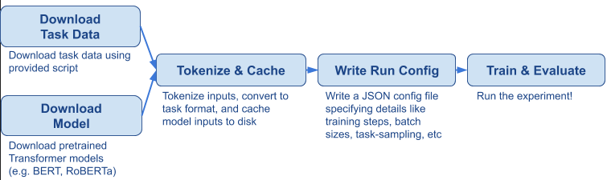
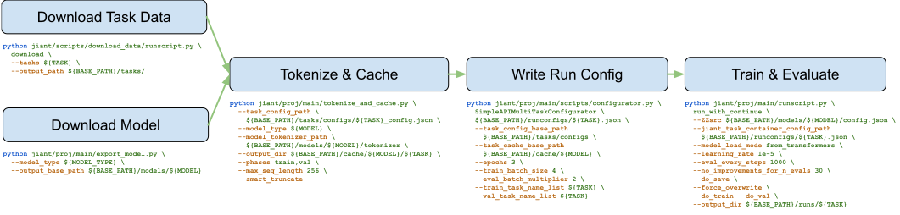

# An In-Depth Introduction to `jiant`

This document provides an in-depth introduction to `jiant`. If you intend to use `jiant` for research and extend its functionality, e.g. adding a task, adding a model, or doing something much more novel (e.g. adding data augmentation, modifying the training pipeline, adversarial training), this is an excellent place to start.

**Contents**: 

* [`jiant`'s models](#jiants-models)
* [`jiant`'s tasks](#jiants-tasks)
* [`Runner`s and `Metarunner`s](#runners-and-metarunners)
* [Step-by-step through `jiant`'s pipeline](#step-by-step-through-jiants-pipeline)

## `jiant`'s models

`jiant` is designed from the ground up to support multi-task training. As such, most models consist of an **encoder** e.g. BERT, and task-specific heads, such as 3-class classification for MNLI, span-prediction for SQuAD, and so on. The original pretraining head for the encoder (e.g. BERT's MLM head) is also often available.

During training, the main model you will interact with is a `JiantModel` (see: [Source](../../jiant/proj/main/modeling/primary.py)). The `JiantModel`'s `.forward()` method takes as input a batch object and the task - the task tells the model which head to use.

**Important**: Somewhat different from many single-encoder-multiple-head architectures, we expose the multiple heads not as different modules within `JiantModel`. Instead, `JiantModel` contains a dictionary to different `Taskmodels` (see: [Source](../../jiant/proj/main/modeling/taskmodels.py)). Each `Taskmodel` contains an encoder and corresponding task-specific head for the task. Each `Taskmodel`'s encoder is the same encoder as the encoder in the `JiantModel` - this is how we effectively share encoders across all our different tasks. The specific reason for this setup is a little nuanced, but it should not impact the regular usage of `jiant`. The important part of all this is that the `Taskmodel` both contains the task-specific head, and the `.forward()` method contains the logic for doing a forward pass on that task. For instance, the `MLMModel` does the random masking during `.forward()`, and the `MultipleChoiceModel` uses the encoder multiple times for a single example (each choice needs to be encoded). The `Taskmodel` also contains the logic for computing the loss for a given task format.

To support different formats of multi-task training, `JiantModel`s can be flexibly configured to have different tasks use the same `Taskmodel` (or task "head"). For instance, you can train on multiple QA tasks, all using the same head. Alternatively for ANLI, you can train on MNLI, SNLI, and ANLI 1-3 all using the same NLI head. These can be configured via the `task_to_taskmodel_map`.

**Summary**

* A `JiantModel` consist of an **encoder** and one or more **task heads**.  
* In practice, this is implemented by the `JiantModel` having one or more `Taskmodels`, all of which share the same encoder, and each having a task-specific output modules (i.e. "heads").
* Users can map multiple tasks to use the same `Taskmodel`.

## `jiant`'s tasks

A "task" is a surprisingly hard to define concept (Is it a dataset? A format like question answering? Can the same "task" be evaluated in different ways?).

In `jiant`, we think of the task as needing the following:

1. Ability to read in data from some raw format
2. Ability to transform raw data input batches (consisting of arrays or tensors)
3. Evaluation scheme for `Taskmodel` outputs

In other words, we need to process task data, and score model outputs. (Note from [the above](#jiants-models) that the loss computation is tied to the `Taskmodel`. The choice of `Taskmodel` is in turn tied to the task.)

### Task preprocessing

The task preprocessing pipeline is define in the task object. For instance, let's look at the `MnliTask` (see: [Source](../../jiant/tasks/lib/mnli.py)). You'll notice several dataclass-like definitions, and finally the `MnliTask` object at the bottom. Our preprocessing works by converting data through a series of processing steps, from raw `Example`s all the way to `DataRow`. Let's go through each step.

1. Raw data → `Example`: The Task object defines how to read in examples from a raw text-based format (often `.jsonl`), and returns a list or iterable of `Example`. `Example`s contain the information we need to ultimately form batches.
2. `Example` → `TokenizedExample`: The `Example` class defines how to go from `Example`s to `TokenizedExample`s. This handles the tokenization of inputs, as well as any tokenization-related processing (e.g. mapping of span indices).
3. `TokenizedExample` → `DataRow`: The `TokenizedExample` class defines how to go from `TokenizedExample`s to `DataRow`s. `DataRow` contain the arrays (e.g. input IDs, input masks) that will ultimately be used to form the batches to be consumed by the `Taskmodel`'s forward method. This is where we handle all the input formatting, such as adding special tokens like `[CLS]` or `<s>`, padding, and concatenating inputs (e.g. concatenating premise and hypothesis, for MNLI). 
4. `DataRow` -> `Batch`: The conversion of `DataRow`s (which consist of NumPy Arrays) to `Batch`es (which consist of PyTorch Tensors) actually happens during the data loading stage. For those more familiar with PyTorch, we handle this via a custom `collate_fn` in `Task.collate_fn` (see: [Source](../../jiant/tasks/core.py)).

Hence, when implementing a task, steps 1-3 need to be implemented, as well as class definition for each of the mentioned data structures: `Task`, `Example`, `TokenizedExample`, `DataRow` and `Batch`. See [Adding Tasks](../tasks/adding_tasks.md) for more details. Steps 1-3 happen in our "Tokenize & Cache" phase, while step 4 happens only during training.

*Note*: A small number of tasks (e.g. any SQuAD variant) have a unique mapping from one `Example` to multiple `DataRow`s.

### Evaluation Schemes

(Evaluation of tasks can be slightly complicated. For simple metrics like accuracy, it is possible to compute some result for each example independently, and then combine them at the end to get the final score. For certain metrics, however, all predictions need to be evaluated together. On the other hand, you have some tasks where it is infeasible to store all predictions in memory. Because of these reasons, our Evaluation Schemes are a little complicated.)

Each task is mapped to an `EvaluationScheme`, which take model predictions and batch data, and outputs a `Metrics` object. 

The `Metrics` object contains the relevant metrics for a given task, and has two important attributes: `major`, which is a scalar, and `minor`. `major` is a single-scalar summary of task performance and is used by the `Metarunner` for early stopping. `minor` is a dictionary that contains all relevant metrics for a task. For instance, many tasks have both `F1` and `EM` metrics, so we would record `F1` and `EM` in the `minor`, and report the average of both in the `major`.

`EvaluationScheme`s themselves are a little complex to explain. During training or evaluation, `EvaluationScheme`s can generate an `Accumulator` object, which records the relevant information for computing the `Metrics` we want at the end. In most cases, this is simply the prediction, but some tasks require more information to be recorded at each training/evaluation step. After we are done with all the training/evaluation data, the `EvaluationScheme` takes the `Accumulator` and outputs the `Metrics` object. 

*Note*: The evaluation code for each task is currently all located in a single file (see: [Source](../../jiant/tasks/evaluate/core.py)) and we will likely move them to individual task implementations soon.

**Summary**

* Tasks need to define how to read and process task data, and score model outputs 
* Tasks need to define a preprocessing pipeline, going from raw data → `Example` → `TokenizedExample` → `DataRow` -> `Batch`. `Batch`es get consumed by `Taskmodel`s.
* Tasks also need to be mapped to `EvaluationScheme`, which define how a task is scored. `EvaluationScheme`s collect gather information via `Accumulator`s during the training/validation phase, and output `Metrics`.

## Runners and Metarunners 

For a given experiment, `Runner`s and `Metarunner`s handle our training and evaluation loops. Why do we have two different objects? We differentiate the responsibilities as follows:

* `Runner`s handle all the logic that's needed to run a training step for a `JiantModel`. This includes everything from setting up data loaders, to sampling tasks, to computing losses and updating the weights.
* `Metarunner`s handle all the training-flow logic, such as early stopping, checkpointing, saving/loading the best models.

If you are trying to experiment on a new modeling method, you are likely to want to subclass the `Runner` rather than the `Metarunner`. For instance, if you want to do some additional regularization based on entropy of the predictions, you would modify the `Runner`'s `training_step`.

## Step-by-step through `jiant`'s pipeline

This is the full end-to-end pipeline for a simple experiment in `jiant`. We include examples of the corresponding bash commands for each one.

Let's assume we are fine-tuning RoBERTa on MRPC. This sounds simple, so why does it require so many steps? The design philosophy behind `jiant` is that we want to support research workflows, and that means exposing as much of the internals to users as possible to allow for maximal inspectability and tweaking. Some of these steps are combined or hidden when using other libraries, but here we expose all the intermediate steps in a hopefully intuitive manner.

### Downloading Task Data and Model

First, we need to get our task data. `jiant` provides a data download script (see: [Source](../../jiant/scripts/download_data/runscript.py)), and saves both the downloaded data as well as task-config JSONs (containing paths to the downloaded data). (**Pro-tip**: Task-config allow you to point to different training/validation sets as needed. A common use-case is training on subsets or modified version of the training data.)

Next, we download our models. These largely wrap around the `.from_pretrained` methods from `Transformers` and saves the relevant model config JSONs, weights, and tokenizer files to disk.

### Tokenize & Cache

As described in [`jiant`'s Tasks](#jiants-tasks), we preprocess our task data from raw files to `DataRow`s and then save them to disk. We refer to this as the task cache. The cache is saved in chunks of 10,000 examples to avoid OOM issues for tasks with many examples.

### Write Run Config

We write a run-configuration JSON that configures many parts of our training setup, including what tasks to train and/or evaluate on, number of steps, task-sampling strategy, batch sizes, gradient accumulation steps, and so on. The script provided (see: [Source](../../jiant/proj/main/scripts/configurator.py)) helps to write the most common run-configuration formats. In this case, we're using the `SimpleAPIMultiTaskConfigurator`. However, more complex workflows can be configured by manually modifying/generating the JSON files. For instance, for zero-shot transfer on XNLI in the XTREME benchmark, we need to configure a model to train on MNLI, evaluate on XNLI in 15 languages (those are 15 different tasks), and all tasks share the same NLI model. These can all be defined in the run-configuration. 

### Train & Evaluate

Finally, we can run our train/evaluation script, which takes some training/evaluation-specific arguments, and paths to some of our above outputs. At the end, you will obtain model weights, validation scores, and/or predictions, depending on your options. For more, see: [My Experiment and Me](../experiments/my_experiment_and_me.md). 
